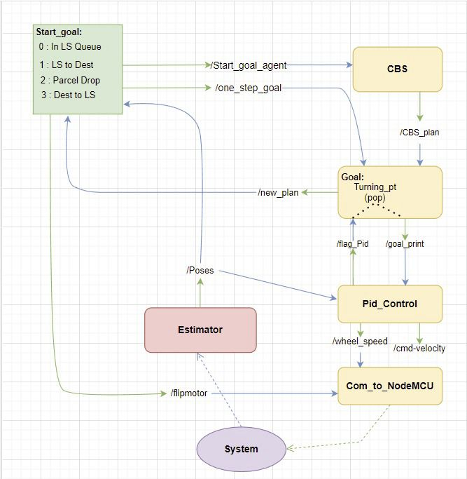

# gridD2C3.0
This repo belongs to IITB folks working on flipkart Grid3.0 D2C

Stucture of the Project:

To run the bot:

step1: roslaunch bot_description view_urdf.launch

step2: roslaunch bot_description gazebo.launch

Packaged to be installed:
1) pandas | pip install pandas
2) xlrd | pip install xlrd

